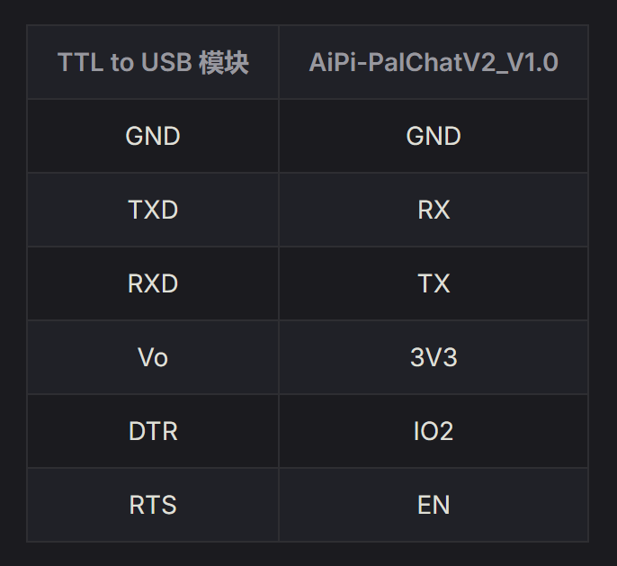
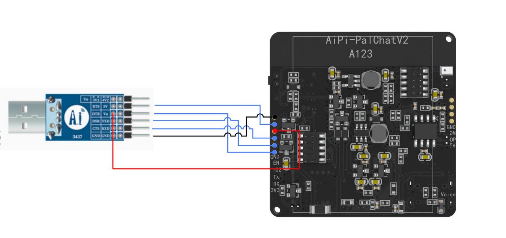
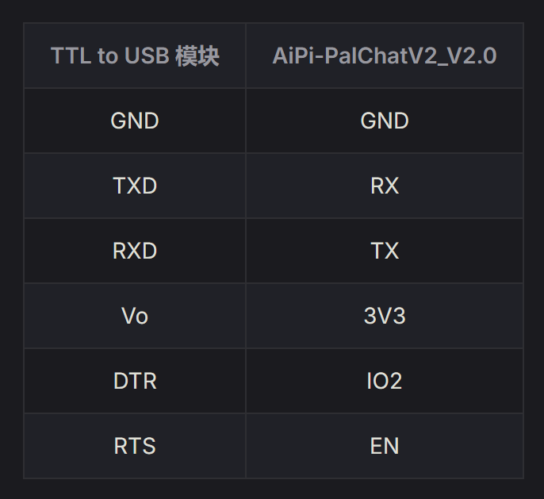
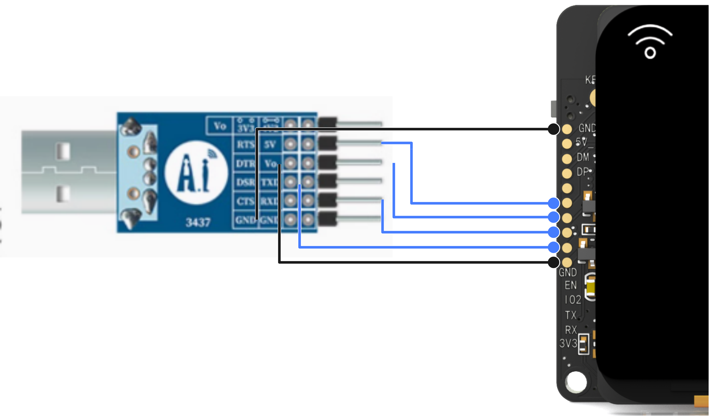

AiPi-PalChatV2

【使用说明】<https://docs.ai-thinker.com/aipi-palchatv2/>

【代码仓库】<https://gitee.com/Ai-Thinker-Open/aipi-palchat_v2/>

接线
- V1.0 版接线

- V2.0 版接线

若使用安信可淘宝店购买的CP2102，波特率选择 921600，若有FT232芯片则可以选择2000000。开发板串口芯片为340C，也可以选择2000000